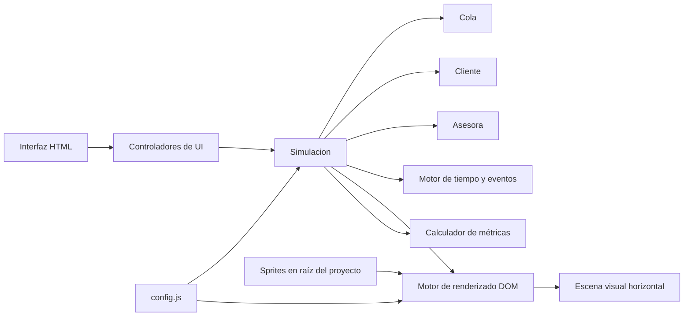
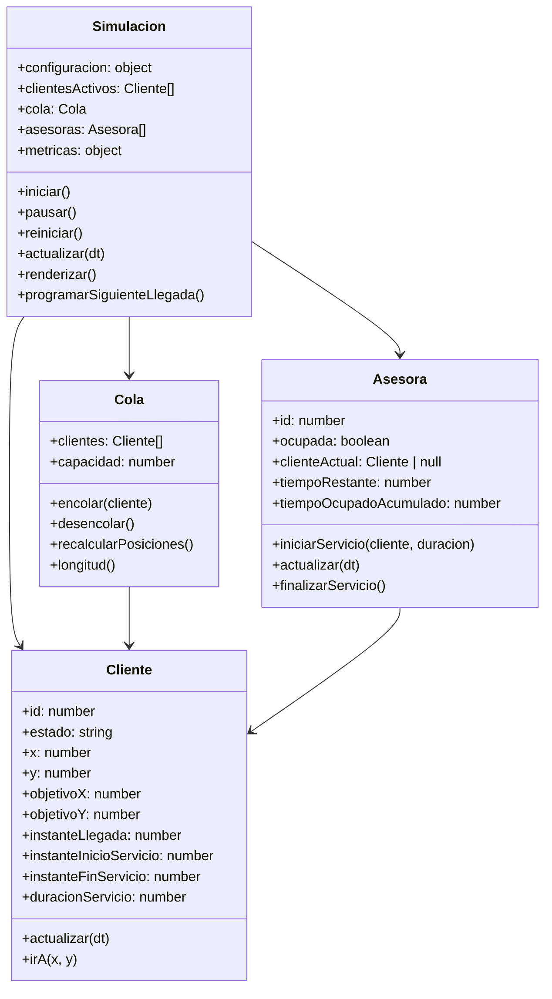

## 1. Diseño de Arquitectura


## 2. Descripción Tecnológica
- Frontend: HTML5 + CSS3 + JavaScript moderno (ES2022), sin frameworks.
- Inicialización: archivos estáticos directos, ejecutables en navegador moderno.
- Backend: ninguno.
- Persistencia: ninguna; configuración y métricas se mantienen en memoria durante la sesión.
- Simulación: motor propio de eventos discretos con interpolación visual continua, sin librerías externas de simulación.

## 3. Definición de Archivos y Estructura
| Ruta | Propósito |
|------|-----------|
| /index.html | Estructura principal de la aplicación, paneles, escena y vínculos de scripts/estilos. |
| /styles.css | Identidad visual corporativa, layout horizontal, tarjetas, sprites y animaciones CSS complementarias. |
| /config.js | Configuración editable, escenarios predefinidos, parámetros visuales y operativos desacoplados. |
| /simulation.js | Lógica orientada a objetos, motor de simulación, renderizado, métricas y flujo FIFO. |
| /cliente.png | Sprite por defecto para clientes. |
| /asesora.png | Sprite por defecto para asesoras. |
| /oficina.png | Fondo de oficina o recurso visual principal de escena. |

## 4. Definición de Clases
| Clase | Responsabilidad |
|-------|------------------|
| `Cliente` | Representa una entidad del sistema con tiempos de llegada, espera, servicio, posiciones objetivo y movimiento suave. |
| `Cola` | Mantiene el orden FIFO estricto, administra capacidad, posiciones disponibles y compactación visual sin huecos. |
| `Asesora` | Gestiona disponibilidad, cliente en servicio, temporización de atención y utilización individual. |
| `Simulacion` | Orquesta eventos, llegada de clientes, asignación de servicio, actualización temporal, renderizado y métricas globales. |

## 5. Rutas e Interacción de Interfaz
| Ruta | Propósito |
|------|-----------|
| / | Vista única que concentra simulación, configuración, métricas y controles. |

## 6. Modelo de Datos en Memoria
### 6.1 Entidades Principales


### 6.2 Estructura de Configuración
```javascript
export const CONFIG = {
  sprites: {
    cliente: "/cliente.png",
    asesora: "/asesora.png",
    oficina: "/oficina.png"
  },
  visual: {
    tamañoCliente: 52,
    tamañoAsesora: 74,
    velocidadMovimiento: 90,
    escalaTiempoVisual: 120
  },
  operacion: {
    capacidadCola: 8,
    cantidadAsesoras: 1,
    tasaLlegada: 3,
    tiempoServicio: 1 / 7
  },
  escenarios: {
    temporadaBaja: {
      tasaLlegada: 3,
      tiempoServicio: 1 / 7,
      cantidadAsesoras: 1
    },
    temporadaAlta: {
      tasaLlegada: 10,
      tiempoServicio: 1 / 7,
      cantidadAsesoras: 2
    }
  }
};
```

## 7. Reglas del Motor de Simulación
- La lógica matemática usa horas como unidad base interna.
- Las llegadas se modelan con tiempos entre arribos de distribución exponencial calculada manualmente con `-Math.log(1 - u) / tasaLlegada`.
- Los tiempos de servicio también se modelan sin librerías externas; se permite usar duración fija configurable o exponencial configurable según la decisión de implementación, priorizando claridad académica.
- La escala temporal visual desacopla el tiempo real del tiempo simulado para que el recorrido sea observable sin acelerar agresivamente.
- Ningún cliente cambia instantáneamente de posición; cada transición se resuelve con movimiento incremental hacia coordenadas objetivo.
- La cola siempre recalcula y reasigna posiciones después de cada entrada o salida del frente.
- Si la cola llega a capacidad máxima, nuevas llegadas quedan contabilizadas como generadas pero no ingresan a la cola operativa; esta condición debe mostrarse claramente si se implementa.

## 8. Estrategia de Renderizado
- Cada cliente y asesora se representa como un nodo DOM absoluto dentro de una escena de oficina.
- `requestAnimationFrame` actualiza el movimiento visual y sincroniza las posiciones.
- El estado de simulación se actualiza en pasos pequeños (`dt`) para evitar saltos visibles.
- La interfaz mantiene separación estricta entre datos de simulación, cálculo de métricas y manipulación del DOM.

## 9. Estrategia de Métricas
- `clientesGenerados`: contador total de llegadas creadas.
- `clientesAtendidos`: total de clientes que completaron el servicio y salieron.
- `clientesEsperando`: longitud actual de cola más clientes moviéndose hacia su posición de espera si aplica.
- `tiempoPromedioEspera`: promedio de `inicioServicio - llegada`.
- `tiempoPromedioSistema`: promedio de `finSalida - llegada`.
- `utilizacionAsesoras`: tiempo ocupado acumulado de todas las asesoras dividido por tiempo disponible total.
- `longitudPromedioCola`: integral acumulada de longitud de cola sobre el tiempo total simulado.

## 10. Consideraciones de Calidad
- Código comentado extensamente para uso académico.
- Configuración centralizada para que parámetros clave cambien sin tocar la lógica.
- Diseño limpio, profesional y no lúdico.
- Sin dependencias de simulación externas y sin AnyLogic.
