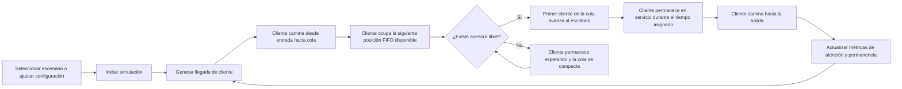

## 1. Descripción del Producto
Aplicación web autónoma para visualizar y analizar una teoría de colas en una agencia de viajes mediante una simulación horizontal, fluida y profesional.
- Permite observar llegadas, espera en cola FIFO, atención por asesoras y salida del sistema con métricas operativas en tiempo real.
- Su valor principal es servir como demostración universitaria/profesional de teoría de colas sin depender de AnyLogic ni librerías externas de simulación.

## 2. Funcionalidades Principales

### 2.1 Roles de Usuario
No se requieren roles diferenciados. La aplicación está orientada a una persona observadora o analista que configura y ejecuta la simulación.

### 2.2 Módulos Funcionales
1. **Panel principal de simulación**: escena horizontal Entrada -> Cola -> Asesoras -> Salida, controles de ejecución y visualización animada.
2. **Panel de configuración**: variables editables desacopladas de la lógica principal para ajustar sprites, velocidades, capacidades y parámetros operativos.
3. **Panel de métricas**: indicadores en tiempo real y comparación del rendimiento del sistema durante la corrida.
4. **Selector de escenarios**: cambio rápido entre Temporada Baja y Temporada Alta con parámetros predefinidos.

### 2.3 Detalle de Página y Módulos
| Nombre de la página | Nombre del módulo | Descripción funcional |
|---------------------|-------------------|-----------------------|
| Simulador principal | Encabezado ejecutivo | Presenta el propósito académico/profesional de la simulación y el estado actual del escenario. |
| Simulador principal | Selector de escenarios | Permite alternar entre Temporada Baja y Temporada Alta, cargando automáticamente tasas y cantidad de asesoras. |
| Simulador principal | Controles | Iniciar, pausar, reiniciar y aplicar configuración sin tocar la lógica del motor. |
| Simulador principal | Configuración editable | Expone `tamañoCliente`, `tamañoAsesora`, `velocidadMovimiento`, `capacidadCola`, `cantidadAsesoras`, `tasaLlegada` y `tiempoServicio`. |
| Simulador principal | Escena de oficina | Dibuja una oficina moderna horizontal con sprites cargados desde la raíz (`/cliente.png`, `/asesora.png`, `/oficina.png`). |
| Simulador principal | Entrada | Punto visual izquierdo donde nacen los clientes y comienzan su trayectoria. |
| Simulador principal | Cola FIFO | Organiza clientes en orden estricto, sin huecos y con reorganización visual progresiva. |
| Simulador principal | Zona de asesoras | Muestra escritorios y asesoras atendiendo clientes disponibles. |
| Simulador principal | Salida | Punto visual derecho hacia donde se desplazan los clientes al terminar su atención. |
| Simulador principal | Métricas en tiempo real | Muestra clientes generados, atendidos, esperando, tiempos promedio, utilización y longitud promedio de cola. |
| Simulador principal | Registro breve de eventos | Resume llegadas, inicio de servicio y salidas recientes para reforzar la interpretación del flujo. |

## 3. Flujo Principal
La persona usuaria selecciona un escenario o ajusta la configuración, inicia la simulación y observa cómo los clientes aparecen en la entrada, se desplazan hasta la cola, avanzan cuando se libera el frente, pasan a una asesora libre y, tras completar el servicio, caminan hacia la salida. Durante toda la ejecución, las métricas se recalculan en tiempo real con base en la lógica matemática del sistema.

## 4. Diseño de Interfaz
### 4.1 Estilo Visual
- Colores principales: gamas suaves de azul petróleo, arena clara, blanco cálido y acentos verde salvia.
- Estilo de botones: redondeados, sobrios, corporativos y con estados hover discretos.
- Tipografía: una fuente serif o display elegante para títulos y una sans refinada para cuerpo y datos.
- Diseño general: tablero ejecutivo de escritorio, escena horizontal central, tarjetas limpias y jerarquía visual clara.
- Iconografía: sutil, institucional y coherente con una agencia de viajes profesional.

### 4.2 Resumen Visual por Módulo
| Nombre de la página | Nombre del módulo | Elementos UI |
|---------------------|-------------------|--------------|
| Simulador principal | Encabezado ejecutivo | Título académico, subtítulo descriptivo, insignia del escenario activo. |
| Simulador principal | Configuración editable | Tarjetas o panel lateral con campos numéricos, etiquetas claras y separación por grupos. |
| Simulador principal | Escena de oficina | Fondo de oficina realista/sobrio, capas suaves, guías horizontales y zonas claramente delimitadas. |
| Simulador principal | Cola FIFO | Marcadores de posición ordenados, sombreado suave y animación de desplazamiento continuo. |
| Simulador principal | Zona de asesoras | Escritorios alineados horizontalmente, asesoras visibles y clientes posicionados frente al puesto. |
| Simulador principal | Métricas | Tarjetas compactas con números destacados, leyendas pequeñas y actualización estable. |
| Simulador principal | Registro de eventos | Lista cronológica breve con sellos de tiempo de simulación y lenguaje descriptivo. |

### 4.3 Responsividad
- Enfoque `desktop-first`, porque la visualización horizontal de la simulación es prioritaria.
- Adaptación móvil secundaria, reorganizando paneles en vertical sin perder la escena principal.
- Debe mantenerse la legibilidad de métricas, controles y configuración en pantallas medianas.

### 4.4 Guía de Escena Visual 2D
- Ambiente: oficina moderna de agencia de viajes, elegante, luminosa y sobria.
- Composición: flujo inequívoco de izquierda a derecha con señalización Entrada -> Cola -> Asesoras -> Salida.
- Movimiento: transiciones suaves y observables, evitando teletransportes o saltos bruscos.
- Capas: fondo institucional, zona de operación, sprites y overlays de información.
- Rendimiento: animación fluida basada en `requestAnimationFrame` y actualización matemática desacoplada.
